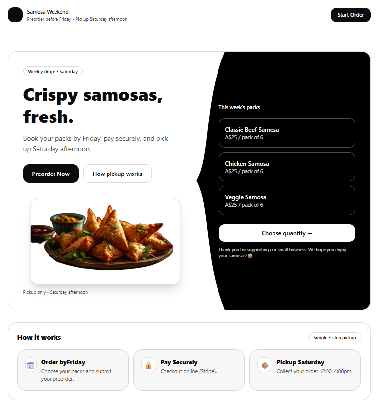
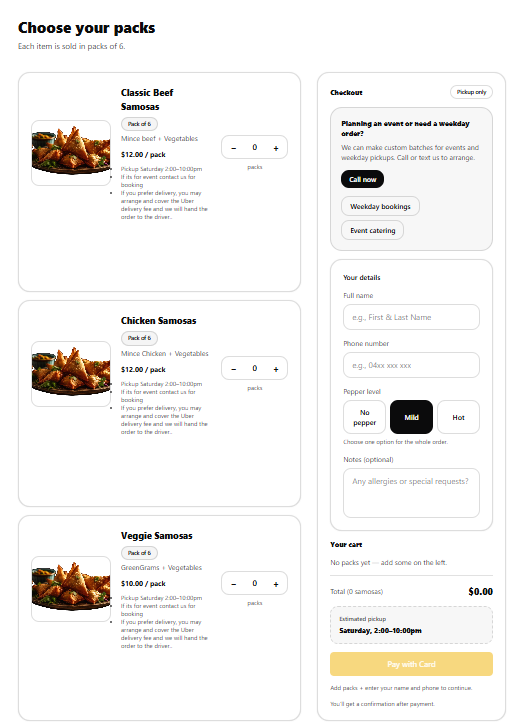
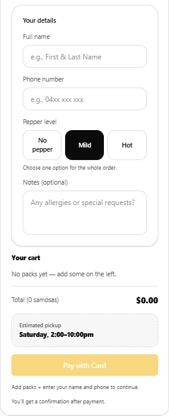
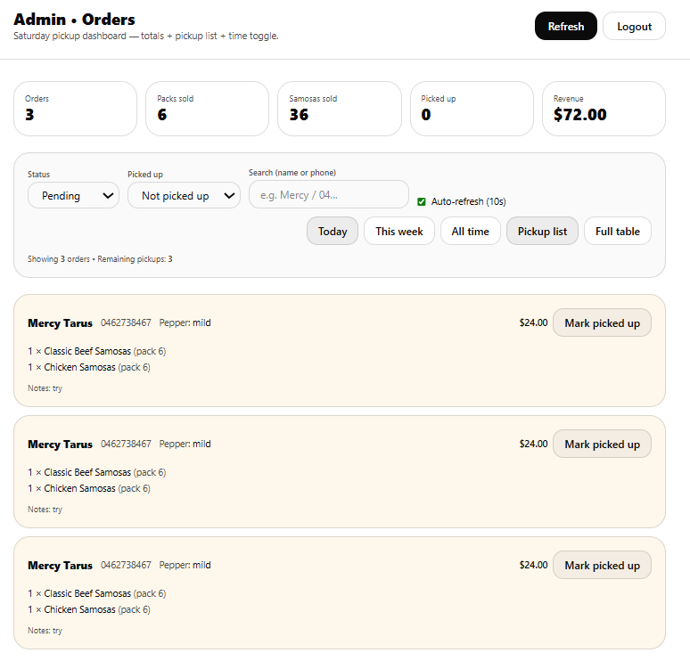

# Samosa Business Ordering System

An online pre-order system for my small samosa business.

Customers can:

- Choose samosa packs
- Pay securely using Stripe
- Pick up orders on Saturday or whichever day I choose

The admin can (Who Is MEEEE):

- View all orders
- Track pickups
- See total samosas to prepare
- Monitor revenue

---

# Tech Stack

Frontend

- React
- Vite
- TailwindCSS

Backend

- Node.js
- Express
- MongoDB
- Stripe Payments

---

# Wire-Frames

## Landing Page



## Order Page



## Stripe Checkout



## Admin Dashboard



---

# How It Works

1. Customer selects samosa packs
2. Payment is processed using Stripe
3. Order is stored in MongoDB
4. Admin prepares samosas
5. Orders are marked **picked up** during Saturday pickup

---

# Installation

Clone the repository

```bash
git clone https://github.com/Tarus-Jepngetich/Samosa-Business.git
```
